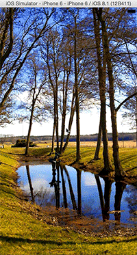

# SASecretCommandViewController

[](https://developer.apple.com/swift)
[](http://cocoadocs.org/docsets/SASecretCommandViewController)
[](http://cocoadocs.org/docsets/SASecretCommandViewController)
[](http://cocoadocs.org/docsets/SASecretCommandViewController)



You can use secret command with swipe gesture and A, B button.

## Features

- [x] Secret command register
- [x] Unlock with secret command
- [x] Show input command with animation

## Installation

#### CocoaPods

SASecretCommandViewController is available through [CocoaPods](http://cocoapods.org). If you have cocoapods 0.36 beta or greater, you can install
it, simply add the following line to your Podfile:

    pod "SASecretCommandViewController"

#### Manually

Add the [SASecretCommandViewController](./SASecretCommandViewController) directory to your project. 

## Usage

If you install from cocoapods, You have to white `import SASecretCommandViewController`.

Extend `SASecretCommandViewController` like this.

```swift

class ViewController: SASecretCommandViewController {

    override func viewDidLoad() {
        super.viewDidLoad()
        // Do any additional setup after loading the view, typically from a nib.
        
        // Register secret command with SASecretCommandType
        let commandList: [SASecretCommandType] = [
            .Up,
            .Up,
            .Down,
            .Down,
            .Left,
            .Right,
            .Left,
            .Right,
            .B,
            .A
        ]
        self.registerSecretCommand(commandList)
        
        //Show inpunt command as icon
        self.showInputCommand = true
    }
}

```

if substitute `true` for `public var showInputCommand`, shown input command on view. On the other hand, if substitute `false`, hidden input command.

Allowed input command is below.
```swift
public enum SASecretCommandType {
    case Up, Down, Left, Right, A, B
}
```
if passed the secret command, called `public func secretCommandPassed()`. Please override that method and write code you want.

For example, showing custom alert.
```swift
override func secretCommandPassed() {
        super.secretCommandPassed()
        
        let font = UIFont(name: "HelveticaNeue-CondensedBlack", size: 16.0)
        let redColor = UIColor.redColor()
        
        let controller = MSAlertController(title: "Command Passed", message: "This is secret mode!!", preferredStyle: .Alert)
        controller.alertBackgroundColor = .blackColor()
        controller.titleColor = redColor
        controller.separatorColor = redColor
        controller.messageColor = redColor
        controller.titleFont = font
        controller.messageFont = font
        let action = MSAlertAction(title: "OK", style: .Default) { (action) in
            self.imageView.image = UIImage(named: "secret")
        }
        action.titleColor = redColor
        action.highlightedColor = .grayColor()
        action.font = font
        controller.addAction(action)
        self.presentViewController(controller, animated: true, completion: nil)
    }
```

## Requirements

- Xcode 6.1 or greater
- iOS7.0(manually only) or greater
- ARC
- QuartzCore.framework

## Other

A sample of this project uses "[MSAlertController
](https://github.com/szk-atmosphere/MSAlertController)" as custom UIAlertController.

## Author

Taiki Suzuki, s1180183@gmail.com

## License

SASecretCommandViewController is available under the MIT license. See the LICENSE file for more info.

